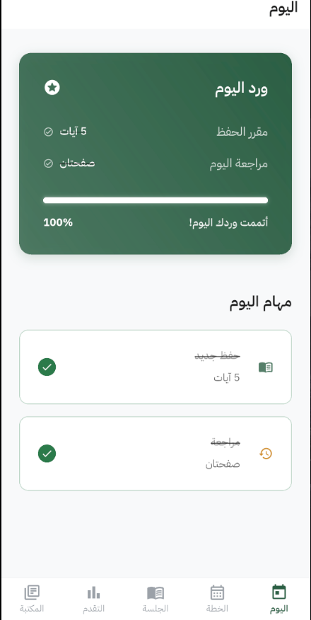
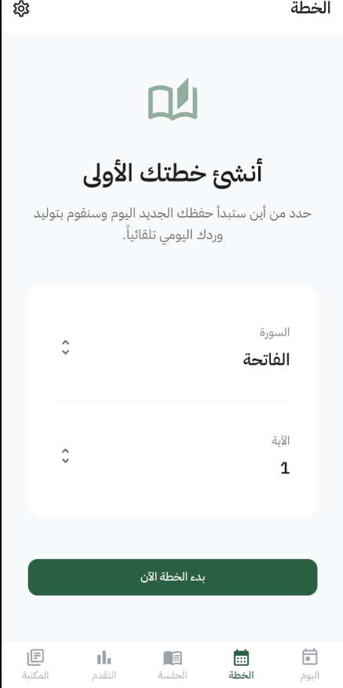
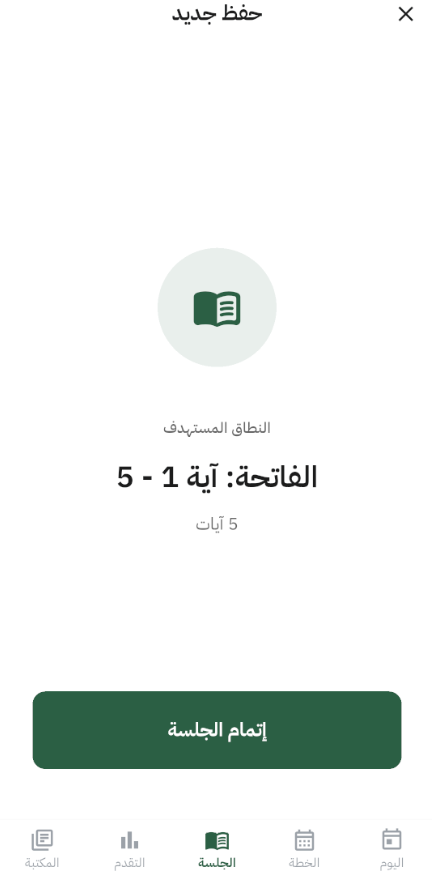
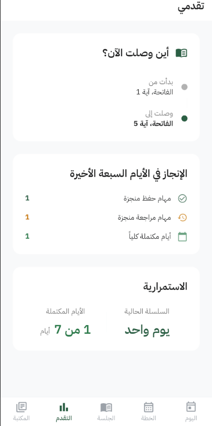
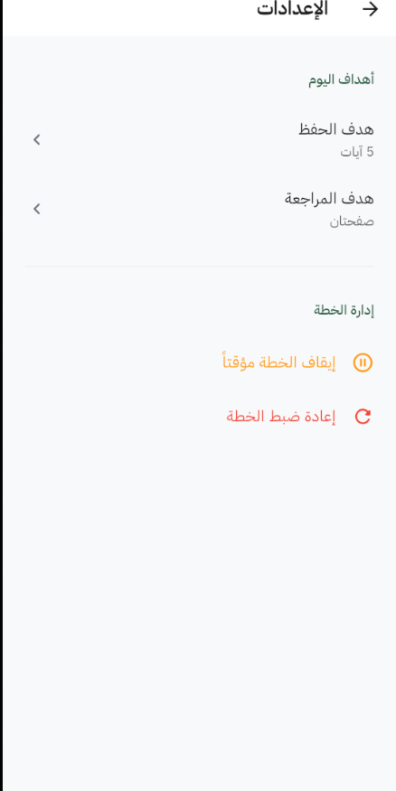
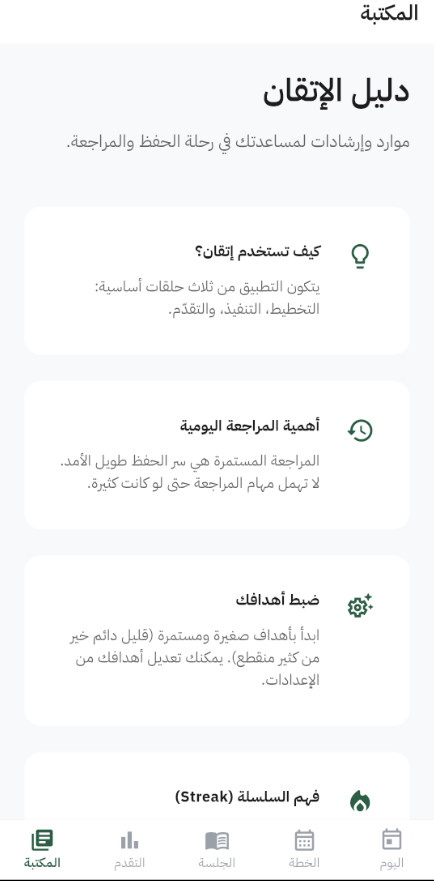

# Itqan (إتقان)

**Itqan** is an Arabic-first Quran memorization and revision "operating system" built with Flutter. Unlike generic readers or trackers, Itqan is designed to be a calm, structured workflow system that supports long-term memorization continuity.

---

## The Problem
Quran memorization requires consistent daily effort and structured revision. Most existing apps focus either on reading or simple progress tracking. Itqan solves the problem of **workflow management**—answering the question: *"What should I memorize and review today, based on my personal plan and previous performance?"*

## Core Features (V1)
- **Guided Setup**: Define your starting point and daily targets (Memorization & Review).
- **Today Workflow**: A focused operational home screen with prioritized daily tasks.
- **Smart Planning**: Automated daily work generation with support for cross-surah progression.
- **Session Execution**: Dedicated interfaces for memorization and review sessions.
- **Progress Insights**: Streak tracking and visual feedback on your memorization journey.
- **Plan Management**: Ability to pause, resume, or archive (reset) plans safely.
- **Guidance Hub**: A resources hub for memorization strategies and app guidance.

## Tech Stack
- **Framework**: [Flutter](https://flutter.dev/)
- **State Management**: [Riverpod](https://riverpod.dev/)
- **Persistence**: [Drift](https://drift.simonbinder.eu/) (SQLite)
- **Navigation**: [GoRouter](https://pub.dev/packages/go_router)
- **Localization**: RTL-native support with [Intl](https://pub.dev/packages/intl)

## Architecture
Itqan follows a modular, feature-first architecture with clear boundaries between layers:
- **Presentation**: UI widgets and Riverpod controllers.
- **Application/Domain**: Business logic, services, and domain entities.
- **Data Access**: Repositories and local database (Drift).

## Getting Started

### Prerequisites
- Flutter SDK (stable channel)
- Dart SDK

### Installation
1. Clone the repository:
   ```bash
   git clone https://github.com/user/itqan_app.git
   ```
2. Install dependencies:
   ```bash
   flutter pub get
   ```
3. Generate Drift/Riverpod code:
   ```bash
   dart run build_runner build --delete-conflicting-outputs
   ```
4. Run the app:
   ```bash
   flutter run
   ```

## Project Status
**Stage**: V1 Release Candidate.
The core memorization loop is stable and production-ready. 

## Known Limitations (V1)
- **Approximation Policy**: Page/Juz/Hizb targets use fixed ayah counts (e.g., 15 ayahs/page).
- **Offline First**: Data is stored locally on-device. Cloud sync is planned for future phases.
- **Session History**: Detailed session analytics (beyond today's completion) are limited in V1.

## Screenshots
### Today


### Plan


### Session


### Progress


### Settings


### Library


---

## License
This project is licensed under the MIT License. See the [LICENSE](LICENSE) file for details.